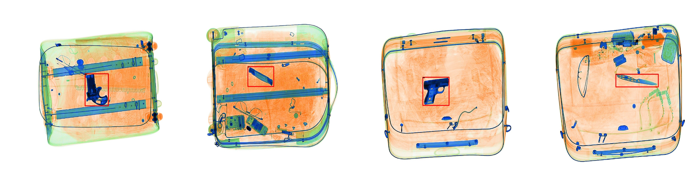
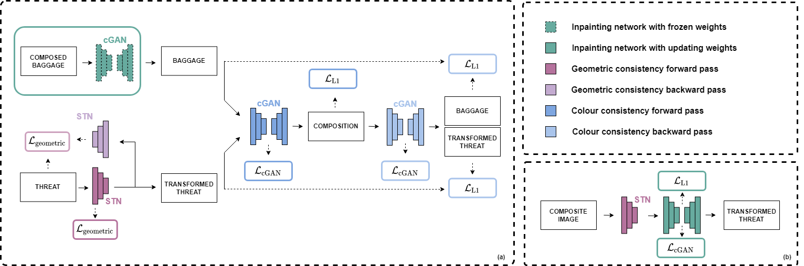

# Cut-and-Paste: Synthetic Image Synthesis by Inserting Object into Image using Deep Convolutional Neural Network

## Abstract
> The cluttered and complex nature of x-ray baggage imagery combined with the time-consuming nature of manual threat
screening highlights the opportunity for computer-vision-based systems to support human operators. Synthetic x-ray imagery can provide screeners with additional examples and facilitate the production of accurate object detection models. This project aims to explore the use of deep-learning-based composition networks to create this data. We investigate the use of a spatial transformer to predict the
threat object location, scale and pose and apply a conditional GAN to predict the insertion appearance. The most accurate composition
model produced can generate realistic composite x-ray imagery with consistent appearance and geometry - a Cascade R-CNN
detector trained on a hybrid dataset containing our composite images achieved an mAP of 75.4%. Although our results do not improve
upon a baseline model trained solely on real data, we highlight the potential of such methods and motivate continued research into
deep-learning-based x-ray image composition with a robust and rigorous investigation into the research question.

## Solution
This is the implementation of [Compositional GAN](https://github.com/azadis/CompositionalGAN) adapted for X-ray image synthesis as well as base dectection models Cascade R-CNN and FSAF using models provided by [MMDetection](https://github.com/open-mmlab/mmdetection). All models are built using PyTorch.
<figure align="center">
    
    <figcaption>Object detection on images generated using our thing</figcaption>
</figure>

The composition model takes as input a baggage-threat pair and generates a composed image where baggage contains the threat item with ycle losses are applied during the transformation and composition stages of the network. The full architecture is shown below.
<figure width="100%" align="center">
    
    <figurecaption>This is the caption for this one</figurecaption>
</figure>

For further details, the full report can be found [here](./resources/report.pdf).
